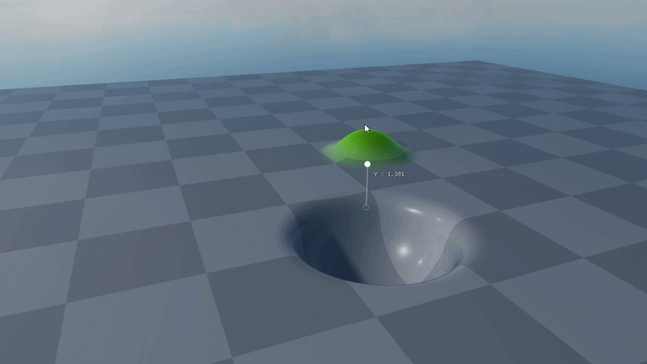
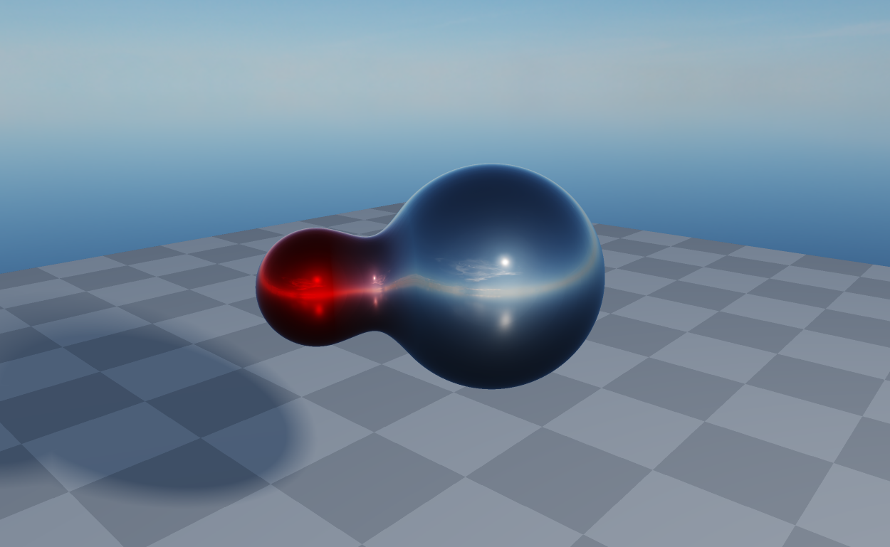
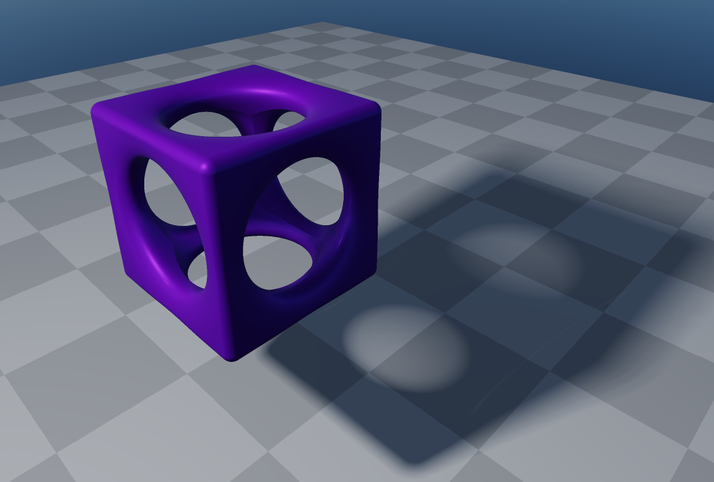

# SDF Renderer

An experimental real-time Signed Distance Field (SDF) raymarching renderer written in C++ and OpenGL. 
It renders SDF scenes by raymarching in the fragment shader on a fullscreen quad.

## Visuals
<p align="center">
 
	<br>
 <em>Example of a sphere used as a smooth subtraction primitive, moved across the scene.</em>
</p>

<p align="center">
 
</p>

<p align="center">
 
 </p>

## Features

- Raymarching-based rendering of Signed Distance Fields
- Primitive support: spheres, rounded boxes, planes
- Scene composition using SDF operations
- Skybox background
- PBR shading (albedo, metalic, roughness, ambient occlusion) with image based lighting (IBL)
- Basic scene editor with ImGui:
	- inspect and edit shapes
	- create / delete shapes
	- scene tweaking
- Free camera controls

## Controls

- Right Mouse Button + mouse: look around
- W / A / S / D: move
- Space / Left Shift: move up / down
- Mouse Wheel: change movement speed


## TODO:

- performance optimizations:
	- scene/object culling cpu side
	- bounding sphere or bounding box checks for primitives

### Requirements

- CMake ≥ 3.20  
- C++20 compatible compiler  
  - GCC 11+  
  - Clang 13+  
  - MSVC 2019+  


### Dependencies

Dependencies included:

- [GLFW](https://www.glfw.org/)
- [GLAD](https://glad.dav1d.de/)
- [glm](https://github.com/g-truc/glm)
- [imgui](https://github.com/ocornut/imgui)
- [imguizmo](https://github.com/cedricguillemet/imguizmo)
- [stb](https://github.com/nothings/stb)


### Build 
```bash
cmake -B out -S .
cmake --build out --config Release
```

> *Use `--config Debug` for debug builds*
