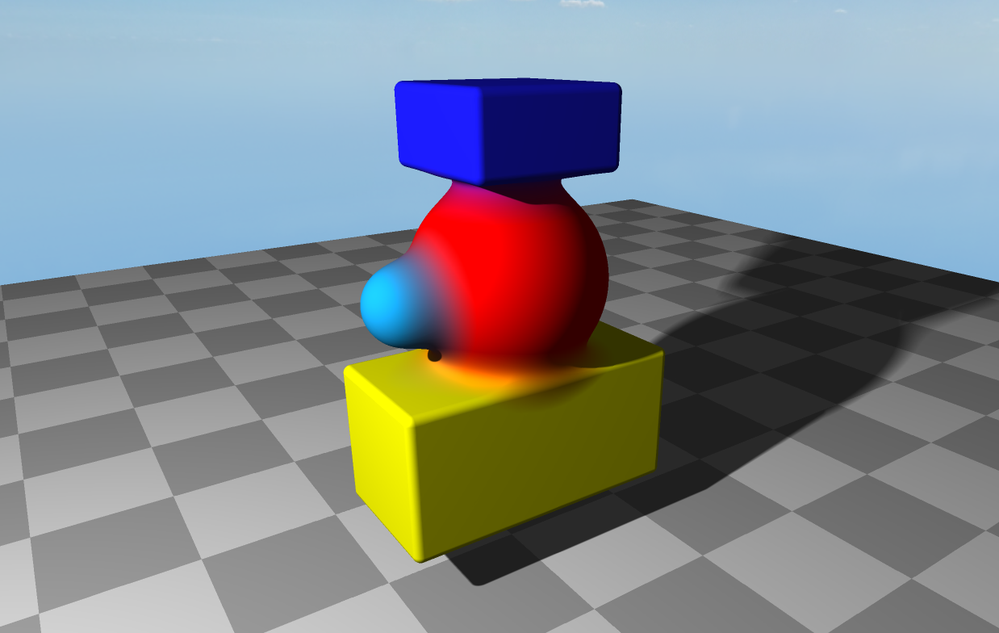

# SDF Renderer

An experimental real-time Signed Distance Field (SDF) raymarching renderer written in C++ and OpenGL. 
It renders SDF scenes by raymarching in the fragment shader on a fullscreen quad.

## Screenshots
<p align="center">
 
 <em>Smooth-unioned SDF primitives with soft shadows</em>
</p>

## Features

- Raymarching-based rendering of Signed Distance Fields
- Primitive support: spheres, rounded boxes
  - planes
- Scene composition using SDF operations
- Skybox background
- Basic ambient + diffuse lighting with soft shadows.
- Basic scene editor with ImGui:
	- inspect and edit shapes
	- create / delete shapes
	- scene tweaking
- Free camera controls

## Controls

- Right Mouse Button + mouse: look around
- W / A / S / D: move
- Space / Left Shift: move up / down
- Mouse Wheel: change movement speed
- '2' key: create sphere


## TODO:

- refactor to have non hardcoded configurable operations (unions, intersections, etc...)
- implement reflections (skybox only first and maybe try recursive if perf ok)
- pbr shading

## Build Instructions

### Requirements

- CMake ≥ 3.20  
- C++20 compatible compiler  
  - GCC 11+  
  - Clang 13+  
  - MSVC 2019+  


### Dependencies

Dependencies included as git submodules:

- [GLFW](https://www.glfw.org/)
- [GLAD](https://glad.dav1d.de/)
- [glm](https://github.com/g-truc/glm)
- [imgui](https://github.com/ocornut/imgui)
- [stb](https://github.com/nothings/stb)


### Build 
```bash
cmake -B out -S .
cmake --build out --config Release
```

> *Use `--config Debug` for debug builds*
